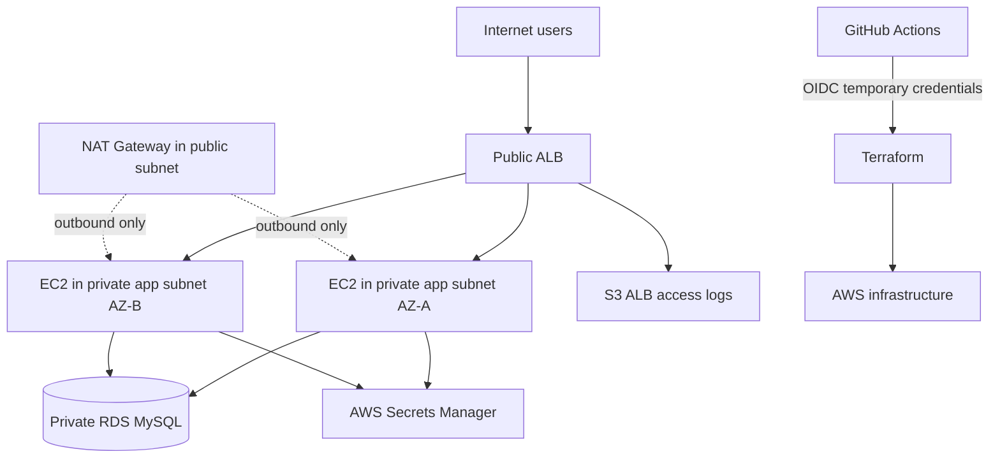

# Architecture

```mermaid
flowchart TD
    U[Internet users] --> ALB[Public ALB]
    ALB --> EC2A[EC2 in private app subnet AZ-A]
    ALB --> EC2B[EC2 in private app subnet AZ-B]
    EC2A --> DB[(Private RDS MySQL)]
    EC2B --> DB
    EC2A --> SM[AWS Secrets Manager]
    EC2B --> SM
    ALB --> S3[S3 ALB access logs]
    GH[GitHub Actions] -->|OIDC temporary credentials| TF[Terraform]
    TF --> AWS[AWS infrastructure]
    NAT[NAT Gateway in public subnet] -. outbound only .-> EC2A
    NAT -. outbound only .-> EC2B
```

Cost note: one NAT Gateway reduces cost but is a single-AZ egress dependency. RDS is single-AZ to reduce cost. The app tier and public ALB span two AZs.
